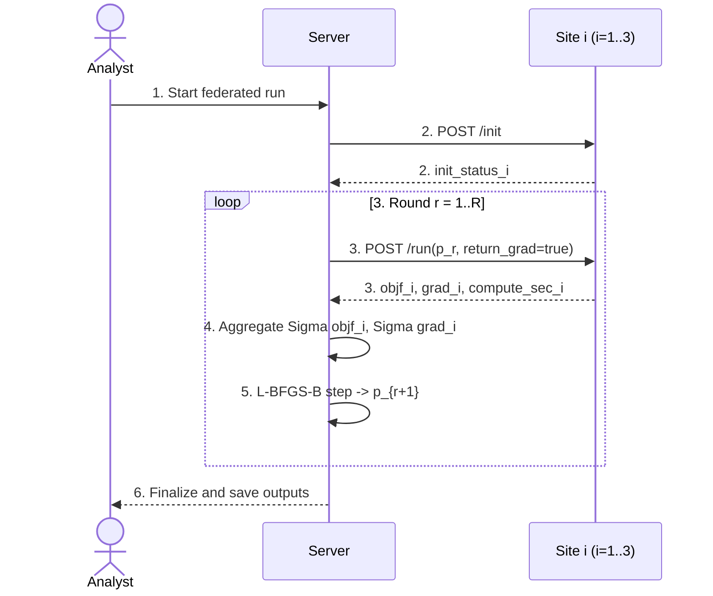

# Federated Communication Sequence with Loop-Scale Timing (Scenario1 + Scenario2)

## Sequence Diagram (Step 1-6)

## Step Summary (1-2, 3-5, 6)

|Scenario|Run ID|1-2 Prep+Init (s)|3-5 Loop total (s)|6 Finalize (s)|Total runtime (s)|
|---|---|---:|---:|---:|---:|
|scenario1|`run_20260307-042406`|6.419|247.5|0.07458|254.1|
|scenario2|`run_20260307-042847`|6.366|254.9|0.07591|261.4|

## Runtime Shares

|Scenario|1-2 share of runtime|3-5 share of runtime|6 share of runtime|
|---|---:|---:|---:|
|scenario1|2.53%|97.43%|0.03%|
|scenario2|2.44%|97.52%|0.03%|

## Loop Bottleneck Decomposition (sums to 3-5 loop total)

|Scenario|3-5 Loop total (s)|Site compute (critical) (s)|Communication wait (sync+poll) (s)|Server local (s)|Compute share|Communication share|Server share|Decomposition gap (s)|
|---|---:|---:|---:|---:|---:|---:|---:|---:|
|scenario1|247.5|243.7|3.459|0.4156|98.43%|1.40%|0.17%|0|
|scenario2|254.9|251.0|3.519|0.4319|98.45%|1.38%|0.17%|0|

## Conclusion (loop-scale)

- Main runtime is dominated by Step 3-5 loop.
- Within the loop, site compute time is the dominant component.
- Communication wait is small under the 3-core server configuration.
